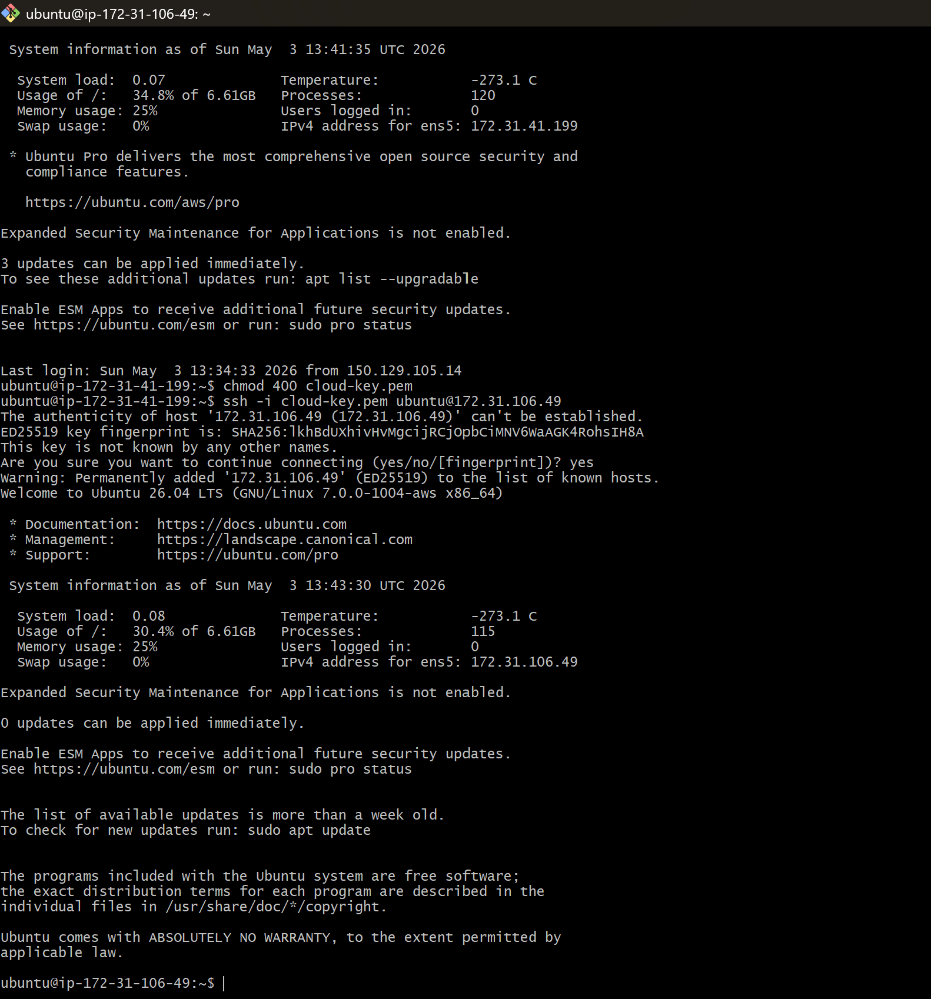
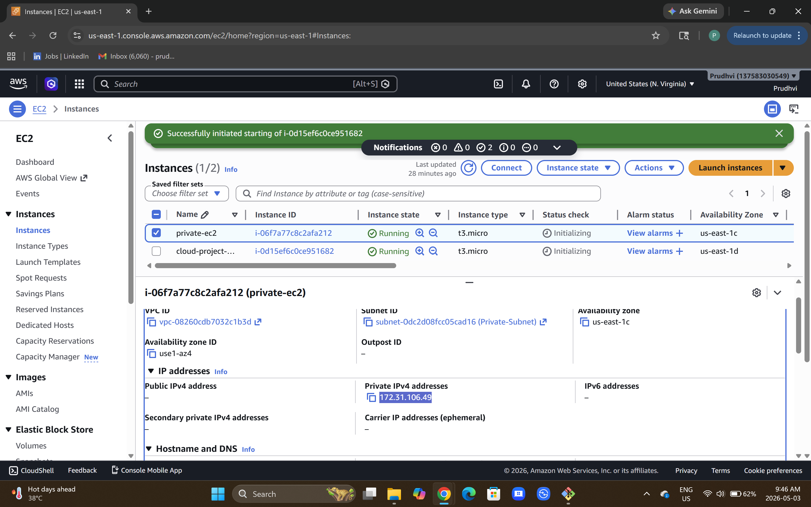
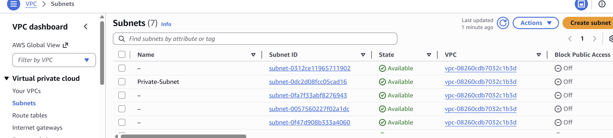

# Cloud Portfolio Website

This project is a personal portfolio website hosted on AWS EC2.

## 🚀 Features
- Deployed using AWS EC2
- Configured secure SSH access using key pairs
- Hosted using nginx web server
- Custom HTML/CSS resume website
  
## 🛠️ Technologies Used
- AWS EC2
- Linux (Ubuntu)
- nginx
- HTML/CSS
  
## ☁️ Deployment Architecture
- Application hosted on AWS EC2 instance
- Ubuntu Linux server used as compute environment
- nginx web server configured to serve static HTML
- SSH key-based authentication used for secure access
- Security Group configured to allow HTTP (80) and SSH (22)

Flow:
User Browser → HTTP Request → AWS EC2 (nginx) → index.html Response

## 📊 AWS Evidence
- EC2 instance launched and managed via AWS Console (:contentReference[oaicite:0]{index=0})
- Secure SSH access configured using key-pair authentication (.pem file)
- Security Groups configured to allow inbound HTTP (80) and SSH (22)
- Public IPv4 address assigned to EC2 instance for web access

## 🔐 IAM Learning Notes
- Learned IAM user vs root user access differences
- Understood region-based resource visibility in AWS
- Configured IAM group with EC2 permissions

## 🧩 Issues Faced
- EC2 instance not visible due to AWS region mismatch between root and IAM user
- Resolved by aligning both sessions to the same region (ap-south-1)

## 🔐 Private Subnet Setup
- Created a private subnet with no internet access
- Launched EC2 without public IP
- Accessed private EC2 securely via public EC2 (bastion host)
-    

## 🔬 Networking Validation
Tested secure architecture by restricting direct SSH access to private EC2 and enabling access only via a public EC2 (bastion host).  
Verified internet isolation by confirming public EC2 has connectivity while private EC2 has no direct internet access.

## 🌐 NAT Gateway (Conceptual Understanding)
Learned how private EC2 instances can securely access the internet using a NAT Gateway without being exposed to inbound traffic.
- NAT Gateway is deployed in a public subnet with an Elastic IP
- Private subnet routes outbound traffic (0.0.0.0/0) to the NAT Gateway
- Enables outbound internet access while maintaining network isolation

## ⚖️ Application Load Balancer (ALB)
- Configured an Application Load Balancer to distribute traffic across multiple EC2 instances  
- Created a target group and registered EC2 instances for traffic routing  
- Installed Apache web servers and validated load balancing between servers  
- Demonstrated high availability concepts using AWS Load Balancer

## 📈 Auto Scaling Group (ASG)
- Created an Auto Scaling Group to automatically launch and terminate EC2 instances based on demand  
- Configured a Launch Template using a custom AMI for automated instance creation  
- Integrated Auto Scaling with Application Load Balancer target group  
- Tested dynamic scaling by increasing CPU utilization and verified automatic EC2 scaling

Note: This was studied conceptually and not implemented to avoid additional AWS costs.

## 🌐 Live Website
http://13.223.50.206

## 📌 About Me
I am a Computer Engineering graduate with a strong foundation in networking (Cisco) and IT infrastructure. I am currently transitioning into cloud computing and actively building hands-on projects using AWS, Linux, and web server technologies.
